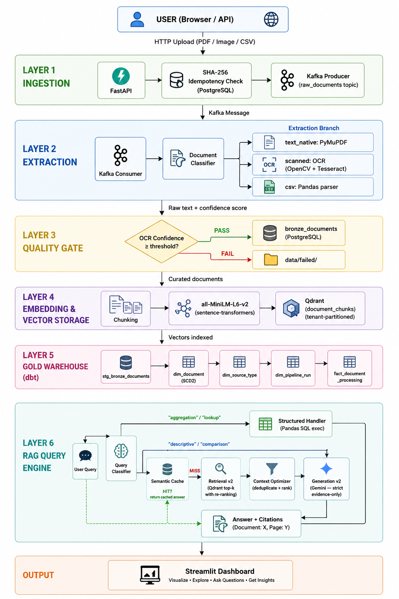
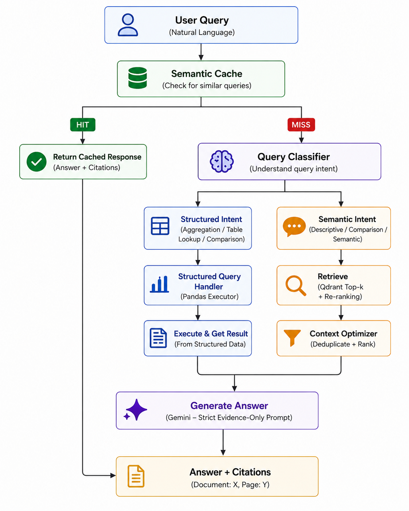

# Document Data Platform

> A production-grade, multi-tenant document ingestion and RAG (Retrieval-Augmented Generation) platform. Upload any document — PDF, scanned image, or CSV — and instantly query it with evidence-backed, cited answers.

<br>

## What Is This?

Most RAG pipelines are simple: you chuck a PDF into a vector database and ask questions. This platform is different.

It is a **fully automated data engineering pipeline** that handles the messy real world — scanned documents with poor quality, multi-tenant user isolation, tabular spreadsheets that trip up vector search — and delivers trustworthy, cited answers. Every single claim made by the LLM is backed by a retrieved document chunk, and the system is architecturally **gated from hallucinating**.

---

## Architecture Overview

The platform is composed of 6 distinct layers that work in sequence:



---


## Layer-by-Layer Breakdown

### Layer 1 — Ingestion (`ingestion/`)

| Component | File | What it does |
|---|---|---|
| REST API | `api.py` | Accepts `multipart/form-data` uploads via FastAPI. Reads the `X-Tenant-ID` header for tenant isolation. |
| Idempotency | `idempotency.py` | Computes a SHA-256 hash of the uploaded file and checks PostgreSQL. If the file has already been seen **by that tenant**, it is silently discarded. |
| Document Classifier | `classifier.py` | Determines the document type: `text_native`, `scanned`, `csv`, or `image` — before it is even queued. |
| Kafka Producer | `kafka_producer.py` | Publishes a JSON event to the `raw_documents` topic. The event includes the file path, tenant ID, document ID, and source type. |

### Layer 2 — Extraction (`extraction/`)

The **Kafka Consumer** (`ingestion/kafka_consumer.py`) picks up events from the `raw_documents` topic and branches into one of three extraction paths:

| Document Type | Extraction Method | Library |
|---|---|---|
| `text_native` PDF | Direct text extraction | **PyMuPDF** (`fitz`) |
| `scanned` PDF / image | OCR pipeline | **OpenCV** (preprocessing) + **Tesseract** |
| `csv` | Structured parsing | **Pandas** |

**OCR Preprocessing Pipeline (for scanned documents):**
```
Raw Image
    │
    ├── Grayscale conversion
    ├── Deskewing (perspective correction)
    ├── Adaptive thresholding
    └── Median blur (noise reduction)
         │
         ▼
   Tesseract OCR → (text + confidence %)
```

### Layer 3 — Quality Gate (`quality/`)

Every extracted document is scored before it is accepted. The gate enforces:
- **Minimum text length** — rejects corrupted or near-empty documents.
- **Minimum OCR confidence** — rejects images that Tesseract could not read reliably.
- **CSV structural validation** — rejects files that don't parse into valid columns/rows.

Documents that **PASS** are written to `bronze_documents` in PostgreSQL with status `curated`. Documents that **FAIL** are written with status `failed` and the raw file is archived to `data/failed/`.

### Layer 4 — Embedding & Vector Storage (`rag/`)

| Component | Detail |
|---|---|
| Embedding Model | `all-MiniLM-L6-v2` via `sentence-transformers` |
| Vector DB | **Qdrant** (self-hosted, Docker) |
| Collection | `document_chunks` |
| Tenant Isolation | Every vector payload stores `tenant_id`; all queries apply a `MatchValue` filter |
| Chunking Strategy | Sliding-window text chunking for prose; row-level chunking for CSV |
| AI Summary | Gemini generates a document-level summary stored alongside each chunk |

### Layer 5 — Gold Warehouse (`warehouse/`)

After embedding, **dbt** is triggered to rebuild the Gold analytical layer on PostgreSQL:

| dbt Model | Type | Description |
|---|---|---|
| `stg_bronze_documents` | Staging | Cleans and standardizes raw Bronze records |
| `dim_document` | SCD Type 2 | Tracks document version history (`valid_from`, `valid_to`, `is_current`) |
| `dim_source_type` | Dimension | Normalises source type labels (`text_native`, `scanned`, `csv`, `image`) |
| `dim_pipeline_run` | Dimension | Records every pipeline execution with timestamps and statuses |
| `fact_document_processing` | Fact | Joins documents to pipeline runs for full audit traceability |

All 13 dbt tests (unique, not_null, relationship constraints) run green.

### Layer 6 — RAG Query Engine (`rag/`)

This is the most sophisticated component. Every user query is intelligently routed:



**Key RAG components:**

| File | Role |
|---|---|
| `query_classifier.py` | Classifies query intent: `aggregation`, `table_lookup`, `comparison`, `descriptive` |
| `structured_query_handler.py` | Executes Pandas queries against in-memory CSV DataFrames for tabular questions |
| `retrieval_v2.py` | Fetches top-k chunks from Qdrant, applies confidence scoring and re-ranking |
| `context_optimizer.py` | Deduplicates and trims chunks to fit the LLM context window |
| `generation_v2.py` | Calls Gemini with a strict evidence-only system prompt; abstains if confidence is below threshold |
| `semantic_cache.py` | Caches query results per tenant; invalidates when the tenant's document collection changes |
| `gemini_client.py` | Manages multiple Gemini API keys with automatic failover and rate-limit handling |

---

## Hallucination Prevention

The LLM operates under a mathematically strict rule set:
1. **Pre-generation gate** — if the best retrieved chunk scores below `0.30`, the system abstains entirely rather than guessing.
2. **Evidence-only system prompt** — the LLM is explicitly instructed that every single claim must be backed by a retrieved chunk.
3. **Citation enforcement** — every statement must include `(Document: <filename>, Page: <number>)`.
4. **Abstention detection** — if the generated answer contains "cannot find sufficient evidence", the system flags it as `abstained=True` and surfaces the abstention to the user.

---

## Multi-Tenant Architecture

Every resource in the system is partitioned by `tenant_id`:

| Layer | Isolation Mechanism |
|---|---|
| PostgreSQL | `WHERE tenant_id = ?` on all queries; composite unique index on `(file_hash, tenant_id)` |
| Qdrant | `MatchValue(tenant_id)` filter on every vector search |
| FastAPI | `X-Tenant-ID` HTTP header propagated through the entire pipeline |
| Streamlit | Per-tenant login; all uploads and queries scoped to the authenticated tenant |

Zero data bleed between tenants has been verified via explicit cross-tenant isolation tests.

---

## Evaluation & Proof of Work

| Test | Result |
|---|---|
| PDF Classification Accuracy | **9/9 (100%)** — correctly routed text-native vs scanned PDFs |
| Idempotency (SHA-256 dedup) | **5/5 (100%)** — duplicate uploads correctly rejected |
| OCR Extraction (scanned PDFs) | **92.22% avg Tesseract confidence** |
| RAG Retrieval Precision@5 | **95.5% overall** (text_native: 100%, scanned_pdf: 100%, image: 66.7%) |
| Custom Doc Integration Test | **4/4 (100%)** — questions answered correctly from newly uploaded documents |
| Multi-tenant Isolation Test | **PASS** — zero data bleed across 3 tenants, 15 documents |
| dbt Gold Rebuild | **PASS=5, WARN=0, ERROR=0** — all 13 data quality tests pass |
| End-to-End Pipeline | **PASS** — FastAPI → Kafka → Extraction → QG → Bronze → dbt Gold → Qdrant → RAG |

---

## Quick Start

### Prerequisites
- Docker Desktop (running)
- Python 3.11
- Tesseract OCR installed (`tesseract --version`)
- Gemini API key(s) in `.env`

### 1. Start Infrastructure

```bash
# Start Kafka, Postgres, and Qdrant
cd infra/
docker compose up -d
docker compose ps          # wait for (healthy) status
```

### 2. Configure Environment

```bash
cp .env.example .env
# Fill in your Gemini API keys in .env
```

### 3. Install Dependencies & Launch

```bash
python -m venv .venv
.venv\Scripts\activate      # Windows
pip install -r requirements.txt

# Start all services with a single command
python run_app.py
```

Open `http://localhost:8501` in your browser.

---

## Project Structure

```
.
├── ingestion/              # FastAPI API, Kafka producer, idempotency, document classifier
├── extraction/             # Text extraction (PyMuPDF), OCR pipeline (OpenCV + Tesseract), CSV parser
│   └── ocr/                # OCR preprocessing and extraction logic
├── quality/                # Quality gate rule engine (confidence scoring, rejection routing)
├── storage/                # PostgreSQL models, Bronze layer writer, SCD2 migration utilities
├── rag/                    # Full RAG pipeline
│   ├── query_classifier.py # Intent classification
│   ├── retrieval_v2.py     # Qdrant vector search with confidence scoring
│   ├── generation_v2.py    # Evidence-only Gemini generation
│   ├── structured_query_handler.py  # Pandas SQL executor for tabular queries
│   ├── semantic_cache.py   # Tenant-aware result cache
│   ├── context_optimizer.py # Chunk dedup and ranking
│   ├── gemini_client.py    # Multi-key Gemini manager with failover
│   └── embed.py            # Chunking, embedding, Qdrant upsert, AI summary
├── warehouse/              # dbt project (staging + gold star schema)
│   └── models/
│       ├── staging/        # stg_bronze_documents
│       └── marts/          # dim_document, dim_source_type, dim_pipeline_run, fact_document_processing
├── orchestration/          # Airflow DAGs (ingestion + nightly batch)
├── dashboard/              # Streamlit frontend (upload, catalog, RAG chat)
├── batch/                  # PySpark nightly reprocessing job
├── evaluation/             # Precision@5 evaluation harness
├── tests/                  # Test scripts and verification utilities
├── samples/                # Sample PDFs, images, CSVs for testing
├── infra/                  # docker-compose.yml (dev) + docker-compose-ec2.yml (prod)
├── run_app.py              # Single-command launcher (FastAPI + Kafka Consumer + Streamlit)
└── requirements.txt
```

---

## Tech Stack

| Category | Technology |
|---|---|
| API | FastAPI + Uvicorn |
| Event Streaming | Apache Kafka 3.8 (KRaft mode) |
| Relational DB | PostgreSQL 15 |
| Vector DB | Qdrant |
| Embeddings | `all-MiniLM-L6-v2` (sentence-transformers) |
| LLM | Google Gemini 2.5-flash / 1.5-flash |
| OCR | Tesseract + OpenCV |
| PDF Extraction | PyMuPDF (fitz) |
| Warehouse | dbt-core + dbt-postgres |
| Orchestration | Apache Airflow |
| Batch Processing | PySpark |
| Frontend | Streamlit |
| Containerization | Docker Compose |
| Language | Python 3.11 |
